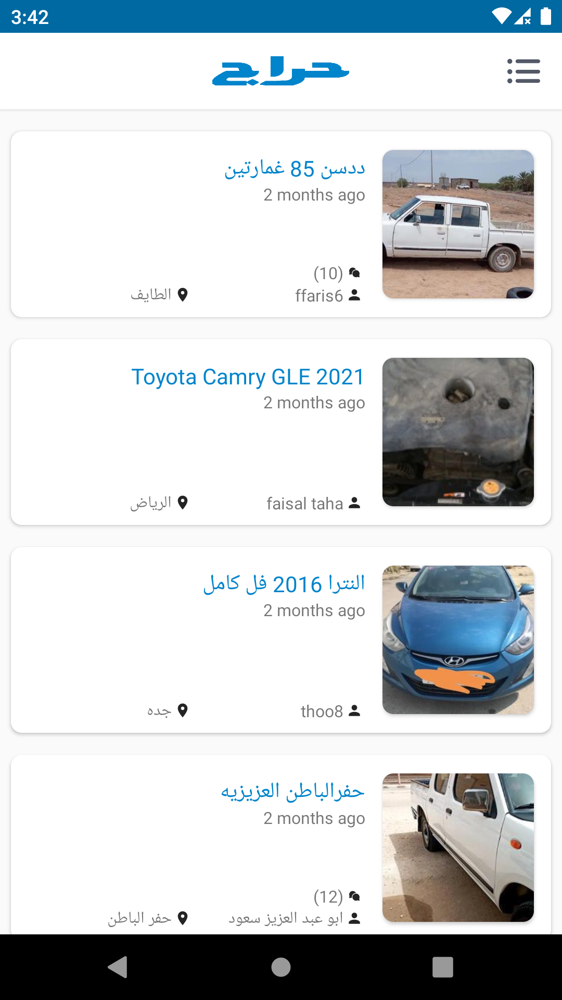
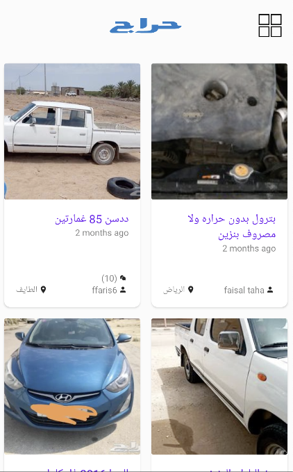
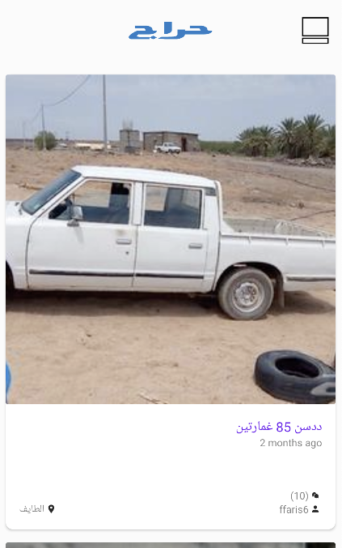
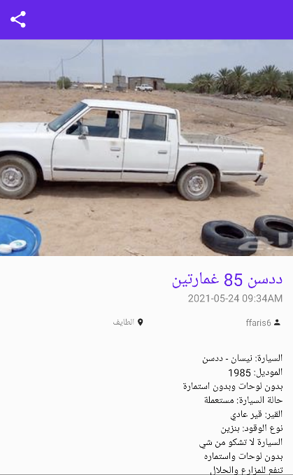

## Haraj Challenge
Welcome to Haraj challenge!

In this repository you will find a sample app ready for implementation. 

You will find icons and a json file containing the data you'll need to complete this challenge.

## Your Mission

Create a functional app with two screens to display information about Posts from Haraj website.

First, a screen showing a list of Posts from the json file you'll find in `assets` folder.

  
  

Second, a screen that displays the information of a particular Post upon click events on the previous screen's list.

The share button should open up Android's native share sheet to share the title of the Post with other apps.

## Evaluation

Your work will be evaluated upon the following:
- Following common design patterns (preferably MVVM).
- Clean and testable code.
- Lightweight UI (avoid nested views)

## Submission
Fork this repository and share us the link to your fork after pushing the changes.
